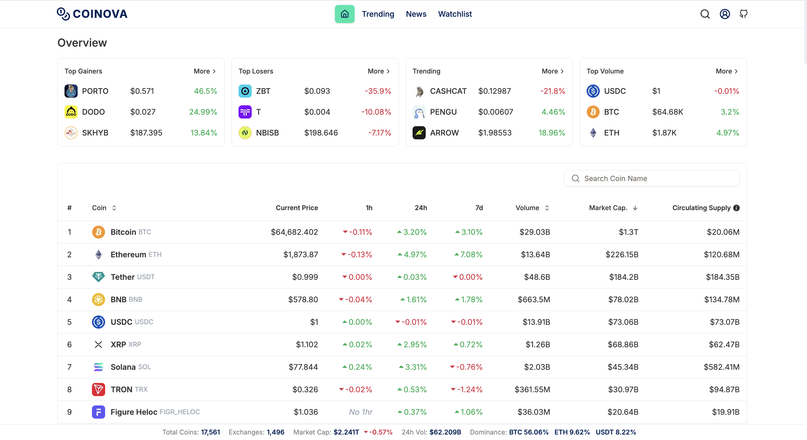

<div align="center">
    <h1>Coinova</h1>
</div>

## Getting Started

A simple coin app with live prices, coin insights, watchlists, and news.

- Visit our app [Coinova](https://coinova-app.vercel.app).

## Features
- Market overview of major coins
- Coin table displaying price, 24-hour price change, trading volume, and market capitalization
- Real-time price updates
- Fully responsive layout for desktop and mobile devices
- Fast and lightweight user experience
- Watchlist and news

## Screenshot


## Tech Stack
- **Framework:** Next.js
- **Library:** React
- **Language:** Javascript, TypeScript
- **Styling:** Tailwind CSS
- **API's:** CoinGecko, Binance, Coinova
- **DB & ORM:** NeonDB, PostgreSQL, Prisma
- **Deployment:** Vercel, Render

## API's Used

- <b>CoinGecko:</b> Used for trending and server side coin list, searching, coin details and for coin analysis.
- <b>Binance:</b> Used for top gainers, losers and volume data.
- <b>Coinova:</b> Used for news and watchlist.

## Installation & Setup

To run the project locally, follow these steps:

```bash
### Prerequisites

- You must have a CoinGecko account to obtain an API key.

### Steps

# Clone the repository
git clone https://github.com/shubhamtak007/coinova.git

# Navigate to the project directory
cd coinova

# Install dependencies
npm install

# Add your API key to .env.development and .env.production
COIN_GECKO_API_KEY=your_api_key_here

# Start the development server
npm run dev
```

## License
Coinova is [MIT licensed](./LICENSE).
